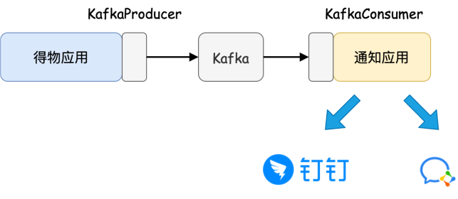
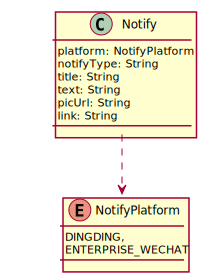
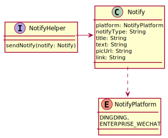
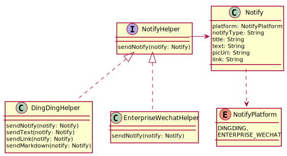
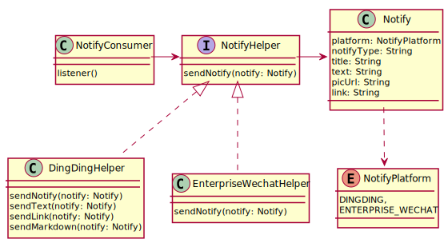

# practice_dewu_kafka

> 利用Kafka完善practice_dewu项目的通知服务。

**服务实现效果展示如下：**

- 通知架构：

1、需要一个通知服务应用，利用Kafka对接得物应用和通知应用

2、利用通知服务应用来给钉钉系统发布消息

在此架构设计中，通知服务应用与得物主体应用完全解耦，通过Kafka消息机制进行通信。

- 项目步骤：

1. 接入钉钉系统通知
2. 构建通知应用，确定消息模型
3. 通知应用接入 KafkaConsumer
4. 改造订单服务接入 KafkaProducer

## 一、接入钉钉

- 查询官方提供的maven仓库，引入依赖：[服务端SDK下载 - 钉钉开放平台 (dingtalk.com)](https://open.dingtalk.com/document/resourcedownload/download-server-sdk)
- 利用钉钉提供的接口完成消息通知

## 二、构建通知应用

- 构建通知模型：

- 设计接口对接平台：

- 完善钉钉通知：

- 接入Kafka消费者：

## 三、接入Kafka

**利用Kafka接入订单通知服务。**

主要步骤：

1. 应用pom.xml接入Kafka
2. 应用application.properties加入Kafka配置文件
3. 在下单接口中加入通知服务

## 四、进一步的需求分析

### （一）实时统计

上述完成下单消息的通知后，若还想知道下单量、付款量等，可以：

#### 1、数据库查询

**因性能问题而受限：**

- 为了统计数据，可能会做大量的查询；
- 为了实时性，可能要频繁地查询。

#### 2、Kafka实时统计

优点：

- **避免实时查询数据库做统计**

在数据有变化的时候，立即更新统计数据，这样曲线图报表就不是实时从数据库查询统计，性能更好；

- **数据统计与网站功能的分为两个项目**

由于数据统计的需求可能变化比较频繁，分为两个项目可以各自独立发布，互相没影响。

### （二）解决并发问题

使用Redis分布式锁

### （三）页面绘制

- 使用Thymeleaf画页面

- 选型使用Chart.js 参考学习官方文档：https://chartjs.bootcss.com/docs/charts/line.html

